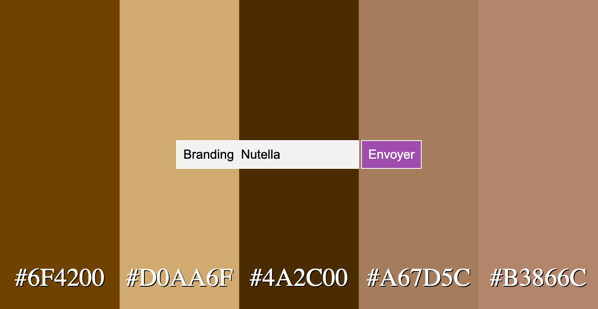

# Color Palette Generator

This project is a web application that generates color palettes based on a given description.

## Features

- Generate color palettes from textual descriptions.
- Copy colors to clipboard by clicking on them.

## How to Use

1. Clone the repository:
   ```sh
   git clone https://github.com/rapprou/generator-color.git

 


